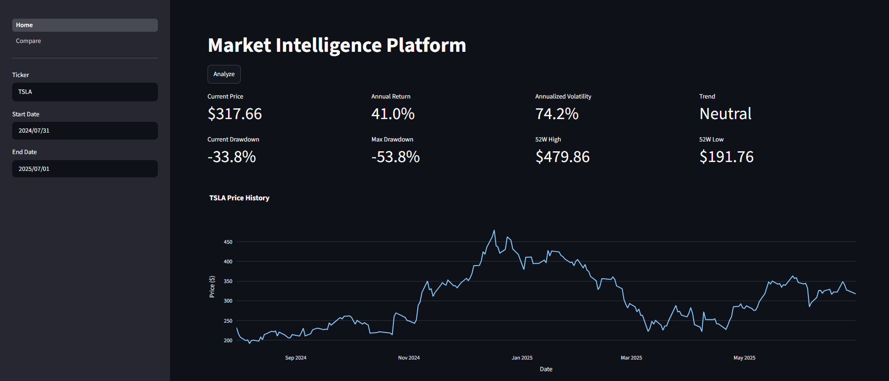
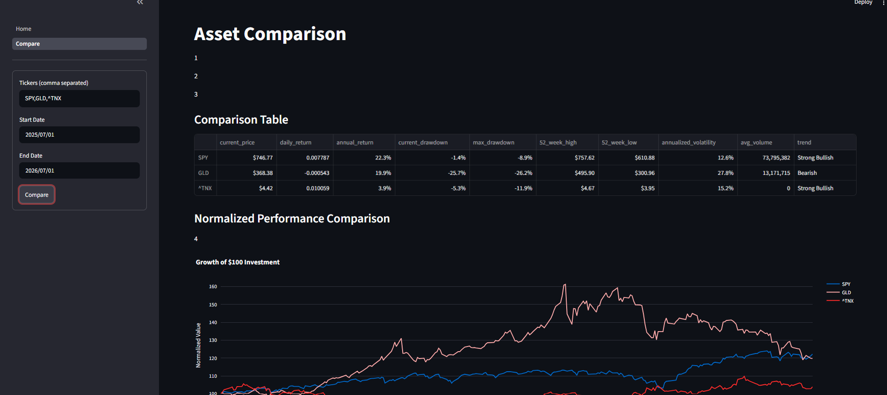
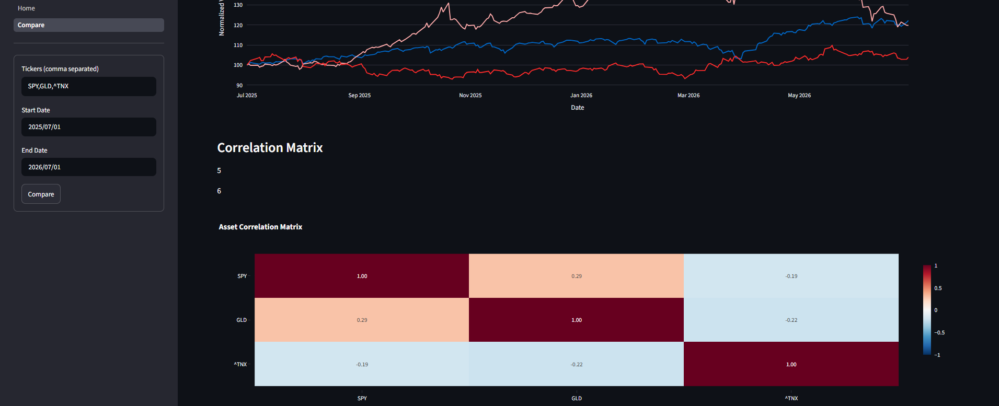

# Market Intelligence Platform

A financial analytics platform built using Python, FastAPI and Streamlit. The project provides market statistics, asset comparison and interactive visualizations using historical market data from Yahoo Finance.

I started this project to learn backend development while building something relevant to quantitative finance. Instead of creating a notebook, I wanted to build a complete application with a modular analytics engine, REST API, and interactive dashboard that could be extended with machine learning in future versions.

---

## Features

### Market Summary

- Current Price
- Daily Return
- Annual Return
- Annualized Volatility
- Current Drawdown
- Maximum Drawdown
- 52 Week High / Low
- Average Volume
- Trend Classification

### Asset Comparison

- Compare multiple assets simultaneously
- Summary table of key metrics
- Interactive price comparison chart
- Correlation heatmap

---

## Tech Stack

- Python
- Pandas
- NumPy
- yfinance
- FastAPI
- Streamlit
- Plotly

---

## Project Structure

```
market_intelligence/

├── api/
│   └── main.py
│
├── dashboard/
│   ├── Home.py
│   └── pages/
│       └── Compare.py
│
├── market_analytics/
│   ├── data_loader.py
│   ├── indicators.py
│   └── analytics.py
│
├── requirements.txt
└── README.md
```

---

## Architecture

```
Yahoo Finance
      │
      ▼
Data Loader
      │
      ▼
Financial Indicators
      │
      ▼
Analytics Engine
      │
      ▼
FastAPI REST API
      │
      ▼
Streamlit Dashboard
```

---

## Analytics Implemented

### Indicators

- Daily Returns
- Log Returns
- Moving Average
- Rolling Volatility
- Monthly Returns
- Annual Returns
- Cumulative Returns
- Drawdown
- Trend Classification

### Analytics

- Market Summary
- Period Analysis
- Asset Comparison
- Correlation Analysis
- Best Performing Months
- Worst Performing Months

---

## Running the Project

Install the required packages

```bash
pip install -r requirements.txt
```

Start the API

```bash
uvicorn api.main:api --reload
```

Run the dashboard

```bash
streamlit run dashboard/Home.py
```

---

## Example Screens

- Market Summary
- Asset Comparison
- Correlation Heatmap
- Interactive Price Charts




---

## Future Improvements

This is Version 1 of the project. Planned improvements include:

- Market Regime Detection
- Historical Market Similarity Search
- AI-powered Financial Assistant (RAG)
- Portfolio Analytics
- Docker deployment
- Automated tests

---

## What I Learned

This project helped me learn how to design a modular Python application instead of writing everything in a single script. It was also my first experience building a REST API with FastAPI and connecting it to a frontend through HTTP requests. Along the way I learned more about financial performance metrics, API design, data visualization and structuring projects in a way that makes them easier to extend.
